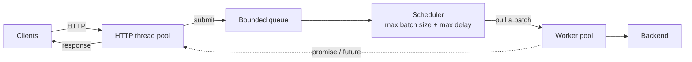

<p align="center">
  
</p>

<h1 align="center">finton</h1>

<p align="center">
  <b>A dynamic-batching inference server in C++20, for ordinary CPUs.</b><br>
  Inspired by NVIDIA Triton Inference Server. No GPU required.
</p>

<p align="center">
  
  
  
  <a href="https://x.com/helyoussfii"></a>
</p>

---

finton receives inference requests over HTTP, groups them into batches, and runs each batch on a pool of worker threads.

The name is *fin* + *ton*: in Moroccan Darija, *fin* means "where" and *ton* is tuna, the kind sold in a can. Hence the monkey asking where his tuna went.

It exists to study one question: **how do batch size and waiting time trade latency against throughput?** Both are exposed as plain numbers, so every setting between "answer at once" and "fill the batch" can be tried and measured.

> **Status.** The serving path works end to end: HTTP in, batching, workers, HTTP out. The model itself is still simulated; a real backend with ONNX Runtime is the next step.

## How it works



1. An HTTP thread reads and parses a request, then submits it to the scheduler.
2. The request waits in a bounded queue. If the queue is full, the client gets a `503` at once.
3. A free worker asks the scheduler for a batch. The scheduler fills it until it reaches the maximum batch size, or until the oldest request has waited the maximum delay.
4. The worker runs the whole batch in one call to the backend.
5. Each request's promise is fulfilled, which wakes its HTTP thread, and the response goes back to the client.

The reasons behind each decision are in [design/arch.md](design/arch.md).

## Features

**Scheduling core**

- Dynamic batching driven by two settings: maximum batch size and maximum delay
- Thread-safe bounded queue that refuses work when full instead of growing
- Workers pull batches when they are free, so batch size adapts to the load
- One promise and future per request, with no shared result table

**HTTP server**

- Hand-rolled HTTP/1.1 parser, with no HTTP library
- Fixed thread pool, one connection per thread
- Keep-alive and pipelined requests
- Separate size limits for headers and body, checked before the body is read
- Timeouts for silent clients
- Graceful shutdown on `Ctrl-C`: every request already received is answered

**Not built yet**

- A real model backend (the backend sleeps to simulate a model)
- Use of the request payload (the body of `/infer` reaches the worker as floats, but the simulated backend ignores it)
- Several models

## Quick start

You need Linux, CMake 3.22 or newer, and a C++20 compiler (GCC 13 recommended). The first configure downloads ONNX Runtime (about 8 MB) and a JSON library; nothing has to be installed by hand.

```bash
cmake -S . -B build-release -DCMAKE_CXX_COMPILER=g++-13 -DCMAKE_BUILD_TYPE=Release -DFINTON_TSAN=OFF
cmake --build build-release
./build-release/finton          # listens on port 3001
./build-release/finton 8080     # or on the port you give
```

From another terminal:

```console
$ curl http://localhost:3001/health
{"status":"ok"}

$ head -c 16 /dev/zero | curl http://localhost:3001/infer --data-binary @-
{"request_id":0,"result":0}
```

The body of `/infer` is raw 32-bit floats, so its size must be a multiple of 4 bytes. The example sends four floats equal to zero.

`result` is the position of the request inside its batch. Send many requests at once and you will see values above 0, which means they shared a batch:

```bash
for i in $(seq 32); do head -c 16 /dev/zero | curl -s http://localhost:3001/infer --data-binary @- & done; wait
```

## HTTP API

| Method | Path | Description |
|---|---|---|
| `GET` | `/health` | Returns `200` when the server is up |
| `POST` | `/infer` | Submits one request to the scheduler and returns its result |

| Status | Meaning |
|---|---|
| `200` | Success |
| `400` | The request is not valid HTTP, or the body of `/infer` is not a whole number of floats |
| `404` | Unknown method or path |
| `413` | `Content-Length` is over the body limit |
| `431` | The headers are over the header limit |
| `500` | Unexpected error while handling the request |
| `503` | The server is overloaded: the queue is full, or every HTTP thread is busy |

## Configuration

The port is a command-line argument. The other settings are set in [`src/main.cpp`](src/main.cpp) and [`src/header/server.hpp`](src/header/server.hpp).

| Setting | Default | Meaning |
|---|---|---|
| `MaxBatchSize` | 8 | Most requests in one batch |
| `MaxDelay` | 5 ms | Longest time a request is held back to fill a batch |
| `MaxQueueSize` | 64 | Requests that can wait in the scheduler. Beyond this: `503` |
| `WorkerCount` | 2 | Worker threads running batches |
| `HttpThreads` | 64 | HTTP threads, which is also the most requests in flight |
| `MaxPendingConnections` | 64 | Accepted connections waiting for a free HTTP thread |
| `HeaderCap` | 8 KB | Largest request head |
| `BodyCap` | 10 MB | Largest request body |
| `IdleTimeoutSeconds` | 5 | A silent client is dropped after this |

`MaxBatchSize` 1 with `MaxDelay` 0 favours latency. A large batch with a long delay favours throughput.

Keep `HttpThreads` above `MaxBatchSize × WorkerCount`. Each HTTP thread sleeps while its request is in the scheduler, so with fewer threads the batches can never fill.

## Build configurations

| Configuration | Command | Use it for |
|---|---|---|
| Sanitized (default) | `cmake -S . -B build -DCMAKE_CXX_COMPILER=g++-13` | Correctness. ThreadSanitizer reports data races |
| Release | `cmake -S . -B build-release -DCMAKE_CXX_COMPILER=g++-13 -DCMAKE_BUILD_TYPE=Release -DFINTON_TSAN=OFF` | Timing |

Follow either with `cmake --build <directory>`.

Timings from the sanitized build mean nothing: the sanitizer makes the program 5 to 15 times slower.

**ThreadSanitizer and GCC 11.** With GCC 11 the sanitized build can stop at startup with `unexpected memory mapping`, and it reports data races on the queue that are not real. Its runtime does not follow the mutex through a timed wait on a condition variable. GCC 13 has neither problem.

## Tests

```bash
cmake --build build
ctest --test-dir build --output-on-failure
```

The tests cover the HTTP parser: valid requests, incomplete requests, malformed requests and the size limits.

## Layout

```
src/
  main.cpp           wires the scheduler, the workers and the server
  header/            class declarations
    request.hpp        a request, its response, and the promise that links them
    queue.hpp          thread-safe bounded queue
    scheduler.hpp      batching policy
    workers.hpp        worker thread pool
    http_parser.hpp    HTTP/1.1 request parser
    server.hpp         HTTP server and its settings
  lib/               implementations
tests/               parser tests
design/              design document, diagrams and logo
```

## Roadmap

- [x] Queue, scheduler and worker pool
- [x] HTTP front end
- [ ] Request payloads as raw bytes (`application/octet-stream`)
- [ ] Real backend with ONNX Runtime
- [ ] Real batching: one tensor and one model call per batch
- [ ] Measurements on a real model
- [ ] Several models, each with its own scheduler

## About

finton is a learning project by Hamza Elyoussfi, built to understand how inference serving works under the hood.

The scheduling core (queue, scheduler, workers) is written by hand. The HTTP layer, the build files, the tests and the documentation were written with AI assistance.

Follow the progress on X: [@helyoussfii](https://x.com/helyoussfii)
