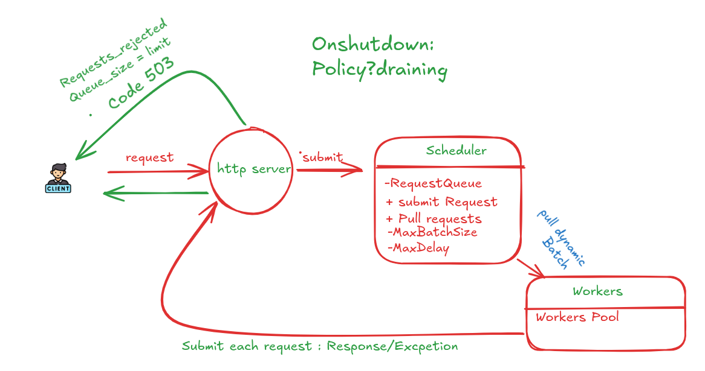
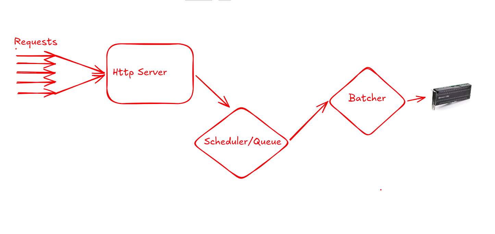

# finton: design decisions

Design and decisions by Hamza Elyoussfi. Written with Claude's assistance.

## 1. What is finton?

**finton** started as a learning project for practising C++, and it still is one. I write the core by hand so that when an AI agent writes code for me, I am able to judge it.

The idea is inspired by NVIDIA Triton Inference Server: software that lets you plug in an AI model and serves it to clients through an API, while managing how inference requests are queued, batched and executed. Unlike Triton, finton targets ordinary CPUs and PCs, not GPUs.

The goal is to understand the trade-off between latency and throughput, and to see exactly where in the code one is favoured over the other.

## 2. Lifecycle of a request

Clients reach finton through an HTTP server (see 3.11). A fixed pool of HTTP threads serves the connections, and each thread handles one client at a time.

A request goes through these steps:

1. **Arrival.** A client sends a request. The HTTP thread that receives it builds a `Request`, which records its arrival time and carries a promise for the response. The thread keeps the matching future.

2. **Submit.** The thread moves the request into the scheduler, which puts it in its queue. The queue is bounded: if it is full, or if the server is shutting down, the submit is refused and the client gets a `503` straight away. A refused request is never queued.

3. **Waiting.** The request sits in the queue in arrival order (FIFO). The HTTP thread blocks on the future, so it uses no CPU while it waits.

4. **Batching.** An idle worker asks the scheduler for a batch. The scheduler does not push work to the workers; they pull it. The scheduler takes the oldest request, then keeps adding requests until one of two things happens:
   - the batch reaches `MaxBatchSize`, or
   - `MaxDelay` has passed since the oldest request of the batch arrived.

   Only one worker builds a batch at a time, so two workers never end up with half a batch each.

5. **Execution.** The worker runs the whole batch in one call to the backend. Today the backend is a simulation that sleeps for a fixed cost plus a cost per request. Later it will be a real model.

6. **Response.** The worker fulfils the promise of each request in the batch. This wakes the HTTP thread waiting on the future, which sends the response to the client.

7. **Next batch.** The worker goes back to step 4.

On shutdown the server stops accepting new requests, the workers finish everything that is already in the queue, and then the threads exit. No accepted request is dropped.

## 3. Design decisions

Each decision below gives what was chosen, what the alternative was, and why.

### 3.1 The queue stores, the scheduler decides

The `Queue` only stores requests and makes access safe between threads. It knows nothing about batches or delays. The `Scheduler` owns the queue as a private member and holds all the policy.

The alternative was one class doing both. Keeping them apart means the locking code is written once, in about fifty lines, and the scheduler reads as pure policy.

### 3.2 A bounded queue that refuses when full

The queue has a maximum size. When it is full, `SubmitRequest` returns `false` and the caller still owns the request, so it can answer the client with a `503`.

The alternatives were an unbounded queue, or making the submitting thread wait. An unbounded queue grows without limit when the server is overloaded, and every request in it waits longer and longer. Making the HTTP thread wait only moves the pile-up one layer up. Refusing early tells the client the truth while it can still retry elsewhere.

### 3.3 Workers pull, the scheduler does not push

An idle worker calls `PullRequests` and gets a batch back.

The alternative was a scheduler thread that forms batches and pushes them to the workers. With push, when every worker is busy, batches are formed early, while they are still small, and then wait in a second queue. With pull, a batch is formed only at the moment a worker is free to run it. While the workers are busy, requests pile up in the queue, so the next batch is bigger. The batch size adapts to the load with no extra code.

### 3.4 Two numbers instead of a mode

The policy is two values: `MaxBatchSize` and `MaxDelay`.

The first idea was an enum such as "favour latency" or "favour throughput". But the trade-off is a dial, not a switch, and an enum would only hide the same two numbers inside the scheduler. A size of 1 with a delay of 0 is the pure latency setting. A large size with a long delay is the pure throughput setting. Everything in between can be tried and measured.

### 3.5 One deadline per batch, counted from the oldest request

When the scheduler takes the first request of a batch, it computes one deadline: that request's arrival time plus `MaxDelay`. Every later wait in the same batch uses this same deadline.

The alternative was to wait up to `MaxDelay` again after each new request. That gives bigger batches, but the first request can then wait many times `MaxDelay`, and the setting stops meaning anything the user can rely on. With one deadline, `MaxDelay` is a promise: no request is held back longer than this just to build a bigger batch.

Two details make this work:

- The deadline is a point in time, not a duration, and it is passed as such to the queue. A point in time does not restart when it is reused.
- Counting from the arrival time includes the time already spent in the queue. Under heavy load the deadline has often already passed when the scheduler reaches the request. In that case the scheduler takes whatever is already queued, up to `MaxBatchSize`, and leaves without waiting. A passed deadline never stops it from taking requests that are already there.

### 3.6 The first request is awaited without a deadline

The queue has two ways to take a request: one that waits until a request exists, however long that takes, and one that gives up at a deadline. The scheduler uses the first for the first request of a batch, and the second for the rest.

With a single timed wait, an idle worker would wake up every `MaxDelay` for nothing. With `MaxDelay` set to 0, which is the latency setting, it would never sleep at all and would use a full CPU core while the server is idle.

### 3.7 One worker builds a batch at a time

`PullRequests` holds a scheduler mutex from start to end. This mutex does not protect the queue, which has its own. It makes sure that only one worker is filling a batch at any moment.

Without it, two idle workers would take requests from the queue in turn and each end up with half a batch. Two half batches cost more than one full batch, because each call to the backend pays the fixed overhead. With the mutex, one worker leaves with a batch that is as complete as possible, and only then does the next worker start filling its own.

The cost is that the worker holding the mutex may be asleep, waiting for requests, while the others wait behind it. This is acceptable because they would have nothing to run anyway. It also sets one rule: `SubmitRequest` must never take this mutex, or a worker waiting for a request would block the very thread that brings one.

### 3.8 Requests can be moved but not copied

`Request` has its copy operations deleted. It is moved from the client into the queue, from the queue into the batch, and it ends its life in the worker.

A request will carry its input data, which is expensive to copy, and it carries a promise, which cannot be copied at all. Deleting the copy operations also made the compiler point at every accidental copy in the code. At any moment exactly one place owns a request. One useful consequence: when a submit is refused, nothing has been moved, so the caller still holds the request.

### 3.9 One promise per request for the response

Each request carries a `std::promise<Response>`. The client keeps the `std::future`. The worker sets the value, and that wakes the client.

The alternative was a shared table of results protected by a lock, or a callback. The promise and future pair is a one-shot channel between exactly two threads, which is what a response is, and it needs no lock of our own. It also covers failure: a request destroyed without an answer makes the waiting side throw instead of waiting forever.

### 3.10 Shutdown drains the queue

On shutdown, new requests are refused, but everything already accepted is processed before the workers exit.

The alternative was to abort: stop at once and drop what is queued. Draining was chosen because an accepted request is a commitment to a client that is waiting.

It works with a single flag inside the queue, set under the queue's lock, followed by a wake-up of every waiting thread. A thread waiting for a request wakes when the queue is not empty, or when the server is stopping. It gets "nothing" only when the server is stopping and the queue is empty, so the workers keep taking batches until nothing is left. The flag can only be set, never cleared, so a stopped server cannot start accepting requests that no worker would ever process.

With the HTTP layer, a stop (Ctrl-C or `kill`) happens in this order:

1. The server stops accepting connections.
2. The HTTP threads finish the requests they have already received, then exit. The workers are still running during this step, because those threads are waiting on them.
3. The scheduler is told to stop. The queue is empty by then, so the workers leave their loop and are joined.

### 3.11 A pool of HTTP threads, one connection per thread

One thread only accepts connections and pushes them into a bounded waiting line. A fixed pool of HTTP threads takes them from there. A thread owns its connection from the first read to the close: it reads and parses the request, submits it, sleeps on the future, and writes the response.

The first version handled everything in the accept loop, so the server served one client at a time and the queue never held more than one request. Batching needs many requests in flight at once.

The alternative was an event loop: non-blocking sockets and `epoll`, with one thread watching every connection. It scales to far more connections, but no thread can sleep on a future, so the workers would have to notify the loop instead. The pool was chosen because it fits the promise and future of 3.9 with no change, and because it keeps the event loop as a later step that can be measured against this one.

What follows from this choice:

- **The pool size is the most requests that can be in flight.** Each thread sleeps while its request is in the scheduler. The pool must be larger than `MaxBatchSize` times the number of workers, or the batches can never fill.
- **Overload is refused at two levels.** When every thread is busy and the waiting line is full, a new connection gets a `503` at once. When the scheduler queue is full, the request gets a `503` (see 3.2).
- **A silent client is dropped after a timeout.** Otherwise it would hold a thread for as long as it likes.
- **Connections are kept alive.** A client can send several requests on one connection, so a measurement does not pay for a new TCP connection on every request.
- **Sizes are limited before the data is read.** The head (request line and headers) has a small limit. The body has a much larger one, checked against the declared `Content-Length`, so an oversized body is refused before it is received.

The HTTP layer was written by Claude, with the decisions above taken together. The queue, the scheduler and the workers are written by hand.

## 4. What the simulated runs showed

The backend is still a simulation, so these are not performance results. Real measurements will come with a real model. Two effects came from the scheduler itself and should stay true with any backend.

**A batch size larger than the load can fill leaves workers idle.** With 16 clients and 2 workers, a maximum batch of 8 gave more throughput than a maximum batch of 16. At 16, one worker took all the waiting requests in a single batch and the other had nothing to do. At 8, both workers ran in parallel.

**Under light load, the delay is paid in full by every request.** With 2 clients and a maximum batch of 8, a batch can never fill, so the scheduler always waits until the deadline. Latency grew by about the value of `MaxDelay`, and throughput fell. When few requests arrive, the best delay is 0.

Together these say that the right settings depend on the load, which is the reason both values are exposed as numbers.

## 5. Limits and next steps

What exists today is the core (queue, scheduler, worker pool, response path and shutdown) and the HTTP server in front of it. It is checked with ThreadSanitizer.

Known limits:

- The backend is simulated. No model is loaded or run.
- A request has an id but no input data yet. The HTTP server receives the body of `POST /infer` and does not pass it on.
- There is one scheduler and one queue, so one model.
- The queue is first in, first out only. There are no priorities.
- The scheduler takes requests from the queue one at a time, with one lock each. Taking several under one lock would reduce contention.
- An HTTP thread is held by its connection even when the client is idle between two requests. An event loop would remove this limit.
- A large body is parsed again each time a new piece of it arrives.

Next steps, in order:

1. Real input and output data in requests, sent as raw bytes (`application/octet-stream`).
2. A real backend with ONNX Runtime, with a small file that describes the model.
3. Real batching: the inputs of a batch joined into one tensor, one call to the model.
4. Measurements on a real model: batch size, delay, number of workers and threads per worker.
5. Several models, each with its own scheduler.

## Appendix: the first sketch

This was the first drawing of the idea, before any code. It is kept to show how the design changed:

- The batcher was a separate stage after the scheduler. It is now part of the scheduler, because forming a batch is a scheduling decision.
- Work was pushed along the chain towards the hardware. Workers now pull batches when they are free (see 3.3).
- The target was a GPU. finton now targets ordinary CPUs.
